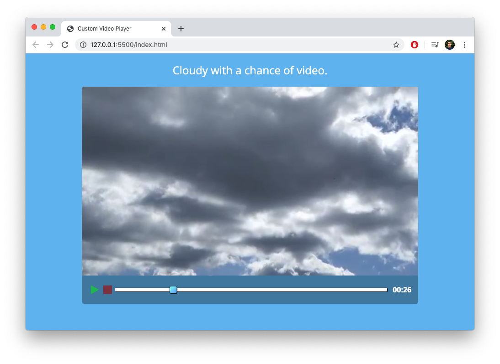

# videoPlayer
 A custom video player.
## Screenshot

## About
I created this custom video player to help learn manipulating HTML5 video controls using the video api and Javascript. I built it using HTML, CSS, and Vanilla JS.
## Credits
- Fast moving clouds timelapse (23 mins in 2 mins) by JivingGerbil on YouTube <https://youtu.be/DU9O-U9YIjk>